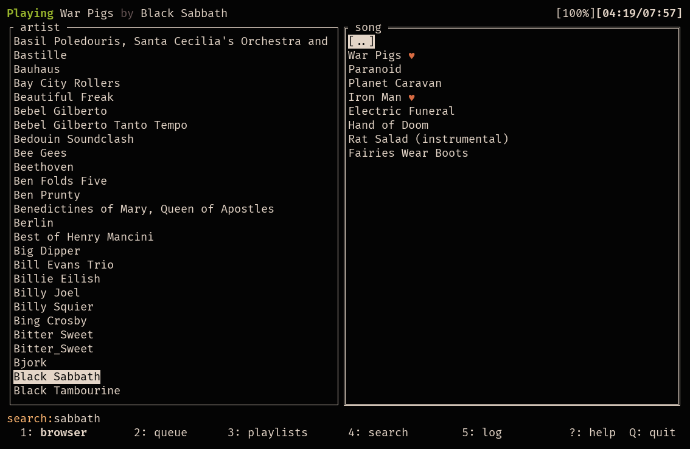

# STMPS (Subsonic Terminal Music Player S)

*Stamps* is a terminal client for *sonic music servers, inspired by ncmpcpp and musickube.

Main Branch:
[](https://github.com/spezifisch/stmps/actions/workflows/build-linux.yml)
[](https://github.com/spezifisch/stmps/actions/workflows/build-macos.yml)

Dev Branch:
[](https://github.com/spezifisch/stmps/actions/workflows/build-linux.yml)
[](https://github.com/spezifisch/stmps/actions/workflows/build-macos.yml)

## Features

- Browse by folder
- Queue songs and albums
- Create and play playlists
- Search music library
- Mark favorites
- Volume control
- Server-side scrobbling (e.g., on Navidrome, gonic)
- [MPRIS2](https://mpris2.readthedocs.io/en/latest/) control and metadata

### Additional features in this branch

- Fix for #88, the global key binding for "refresh server" overrode "save playlist"; it was changed to 'c'
- Song info panel (song information, lyrics, and cover art) can be toggled with 'i'
- Synced lyrics are shown, and synced with the music, if the server supports `getLyricsBySongId/`. Currently, a PR in gonic provides this through filesystem `.lrc` files. This version of gonic is in the main branch of [@danielepintore's fork](https://github.com/danielepintore/gonic.git).
- The search tab can toggle between "search for anything" (via `search3/`), or search-by-genre (via `getSongsByGenre/`. As part of this, switching to the genre search in the search tab with 'g' also shows a list of all known genres, which can be browsed.
- Includes refactoring s.t. the interface reflects song metadata, and not directory structure. This mainly affects the UI in the browser tab, where the left column is _always_ the list of artists, and the right column is _always_ either albums or songs. Consequently, the right column title is accurate, and can't be browsed out of the artist.
- Playlists now behave like the rest of the UI items, and are not loaded in the background. The list of playlists is consequently immediately available, although browsing through the list now calls to the server and can be slower until all playlists are loaded.

## Screenshots

These screenshots use [Navidrome's demo server](https://demo.navidrome.org/) ([config file](./stmp-navidromedemo.toml)).

### Queue


### Browser



## Dependencies

### Required Software

- [mpv](https://mpv.io)
- Linux (Debian/Ubuntu): `apt install pkg-config libmpv libmpv-dev`
- MacOS (Homebrew): `brew install pkg-config mpv` (not the cask)

### Go Build Dependencies

- Go 1.22+
  - [tview](https://github.com/rivo/tview)
  - [go-mpv](https://github.com/supersonic-app/go-mpv) (supersonic's fork)

## Compiling

Compile STMPS with `go build`. Cgo is needed for interfacing with libmpv.

STMPS can be installed without checking out the repository by running:

```bash
  go install github.com/spezifisch/stmps@latest
```

### Developers & Distribution Packagers

There's a Makefile with tasks for:

- Updating the CHANGELOG.md
- Running tests & linting commands
- Compiling an executable with a derived tag for the version

These tasks depend on the following tools:

- [git-cliff](https://git-cliff.org/) for updating the CHANGELOG.md
- [markdownlint](https://github.com/igorshubovych/markdownlint-cli) for running the markdown linting test
- [golangci-lint](https://github.com/golangci/golangci-lint) for linting the Go code

## Configuration

STMPS looks for a configuration file named `stmp.toml` in either `$HOME/.config/stmp` or the directory containing the executable.

### Example Configuration

```toml
[auth]
username = 'admin'
password = 'password'
plaintext = true  # Use 'legacy' unsalted password authentication (default: false)

[server]
host = 'https://your-subsonic-host.tld'
scrobble = true  # Use Subsonic scrobbling for last.fm/ListenBrainz (default: false)

[client]
random-songs = 50

[ui]
spinner = '▁▂▃▄▅▆▇█▇▆▅▄▃▂▁'
```

## Usage

### General Navigation

- `Q`: Quit
- `1`: Folder view
- `2`: Queue view
- `3`: Playlist view
- `4`: Search view
- `5`: Log (errors, etc.) view
- `Escape`/`Return`: Close modal if open

### Playback Controls

These controls are accessible from any view:

- `p`: Play/pause
- `P`: Stop
- `>`: Next song
- `-`/`=`: Volume down/volume up
- `,`/`.`: Seek -10/+10 seconds
- `r`: Add 50 random songs to the queue
- `c`: Start a server library scan

### Browser Controls

- `Enter`: Play song (clears current queue)
- `a`: Add album or song to queue
- `y`: Toggle star on song/album
- `A`: Add song to playlist
- `R`: Refresh the list (if in artist directory, only refreshes that artist)
- `/`: Search artists
- `n`: Continue search forward
- `N`: Continue search backward
- `S`: Add similar artist/song/album to playlist

### Queue Controls

- `d`/`Delete`: Remove currently selected song from the queue
- `D`: Remove all songs from queue
- `y`: Toggle star on song
- `i`: Toggle song info panel
- `k`: Move song up in queue
- `j`: Move song down in queue
- `s`: Save the queue as a playlist
- `S`: Shuffle the songs in the queue
- `l`: Load a queue previously saved to the server

When stmps exits, the queue is automatically recorded to the server, including the position in the song being played. There is a *single* queue per user that can be thusly saved. Because empty queues can not be stored on Subsonic servers, this queue is not automatically loaded; the `l` binding on the queue page will load the previous queue and seek to the last position in the top song.

If the currently playing song is moved, the music is stopped before the move, and must be re-started manually.

The save function includes an autocomplete function; if an existing playlist is selected (or manually entered), the `Overwrite` checkbox **must** be checked, or else the queue will not be saved. If a playlist is saved over, it will be **replaced** with the queue contents.

### Playlist Controls

- `n`: New playlist
- `d`: Delete playlist
- `a`: Add playlist or song to queue
- `R`: Refresh playlists from server

### Search Controls

The search tab performs a server-side search for text in metadata name fields. The search results are filtered into three columns: artist, album, and song, where each entry matches the query in name or title.

In any of the columns:

- `/`: Focus search field.
- `Enter` / `a`: Adds the selected item recursively to the queue.
- Left/right arrow keys (`←`, `→`) navigate between the columns
- Up/down arrow keys (`↓`, `↑`) navigate the selected column list
- `g`: toggle genre search

In the search field:

- `Enter`: Perform the query.
- `Escape`: Escapes into the columns, where the global key bindings work.

Note that the Search page is *not* a browser like the Browser page: it displays the search results returned by the server. Selecting a different artist will not change the album or song search results.

In Genre Search mode, the genres known by the server are displayed in the middle column. Pressing `Enter` on one of these will load all of the songs with that genre in the third column. Searching with the search field will fill the third column with songs whose genres match the search. Searching for a genre by typing it in should return the same songs as selecting it in the middle column. Note that genre searches may (depending on your Subsonic server's search implementation) be case sensitive.

## Advanced Configuration and Features

### MPRIS2 Integration

To enable MPRIS2 support (Linux only), run STMPS with the `-mpris` flag. Ensure you have D-Bus set up correctly on your system.

### MacOS Media Control

On MacOS, STMPS integrates with the native MediaPlayer framework to handle system media controls. This is automatically enabled if running on MacOS. *Note:* This is work in progress.

### Profiling

To profile the application, use the following flags:

- `-cpuprofile=<file>`: Write CPU profile to `file`
- `-memprofile=<file>`: Write memory profile to `file`

These flags are useful for performance debugging and analysis.

### Debugging and Logs

View logs and error messages in the log view by pressing `4`. This can help diagnose issues with server connections, playback, or other functionalities.

## Contributing

Contributions are welcome! Feel free to open issues or submit pull requests on GitHub. For major changes, please discuss first to ensure alignment with the project goals.

Please base your PRs against the `main` branch.

Note that [pre-commit](https://pre-commit.com/) hooks are supplied. You can use them to automatically ensure proper formatting before committing. Alternatively, you might be able configure your editor to do this via `gofmt` for you.

## Credits

This is a fork of [STMP](https://github.com/wildeyedskies/stmp). See [AUTHORS](./AUTHORS) for more information. The codebase has diverged significantly from the original.

## Licensing

STMPS is licensed under the GNU General Public License v3.0 (GPL-3.0-only). This license allows you to freely use, modify, and distribute the software, provided that any distributed versions of the software, or derivative works, are also licensed under the GPL-3.0-only.

For more details, refer to the [LICENSE](./LICENSE) file in the repository.
