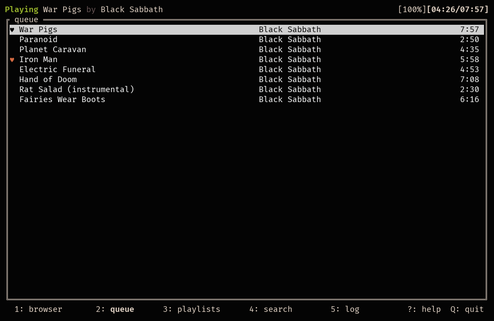

# STMPS (Subsonic Terminal Music Player S)

*Stamps* is a terminal client for *sonic music servers, inspired by ncmpcpp and musickube.

Main Branch:
[](https://github.com/spezifisch/stmps/actions/workflows/build-linux.yml)
[](https://github.com/spezifisch/stmps/actions/workflows/build-macos.yml)

Dev Branch:
[](https://github.com/spezifisch/stmps/actions/workflows/build-linux.yml)
[](https://github.com/spezifisch/stmps/actions/workflows/build-macos.yml)

## Features

- Browse by folder
- Queue songs and albums
- Create and play playlists
- Mark favorites
- Volume control
- Server-side scrobbling (e.g., on Navidrome, gonic)
- [MPRIS2](https://mpris2.readthedocs.io/en/latest/) control and metadata

## Screenshots

These screenshots use [Navidrome's demo server](https://demo.navidrome.org/) ([config file](./stmp-navidromedemo.toml)).

### Queue



### Browser


## Dependencies

### Required Software

- [mpv](https://mpv.io)
- Linux (Debian/Ubuntu): `apt install pkg-config libmpv libmpv-dev`
- MacOS (Homebrew): `brew install pkg-config mpv` (not the cask)

### Go Build Dependencies

- Go 1.22+
  - [tview](https://github.com/rivo/tview)
  - [go-mpv](https://github.com/supersonic-app/go-mpv) (supersonic's fork)

## Compiling

Compile STMPS with `go build`. Cgo is needed for interfacing with libmpv.

## Configuration

STMPS looks for a configuration file named `stmp.toml` in either `$HOME/.config/stmp` or the directory containing the executable.

### Example Configuration

```toml
[auth]
username = 'admin'
password = 'password'
plaintext = true  # Use 'legacy' unsalted password authentication (default: false)

[server]
host = 'https://your-subsonic-host.tld'
scrobble = true  # Use Subsonic scrobbling for last.fm/ListenBrainz (default: false)

[client]
random-songs = 50
```

## Usage

### General Navigation

- `Q`: Quit
- `1`: Folder view
- `2`: Queue view
- `3`: Playlist view
- `4`: Log (errors, etc.) view
- `Escape`/`Return`: Close modal if open

### Playback Controls

These controls are accessible from any view:

- `p`: Play/pause
- `P`: Stop
- `>`: Next song
- `-`/`=`: Volume down/volume up
- `,`/`.`: Seek -10/+10 seconds
- `r`: Add 50 random songs to the queue

### Browser Controls

- `Enter`: Play song (clears current queue)
- `a`: Add album or song to queue
- `y`: Toggle star on song/album
- `A`: Add song to playlist
- `R`: Refresh the list (if in artist directory, only refreshes that artist)
- `/`: Search artists
- `n`: Continue search forward
- `N`: Continue search backward
- `S`: Add similar artist/song/album to playlist

### Queue Controls

- `d`/`Delete`: Remove currently selected song from the queue
- `D`: Remove all songs from queue
- `y`: Toggle star on song

### Playlist Controls

- `n`: New playlist
- `d`: Delete playlist
- `a`: Add playlist or song to queue

## Advanced Configuration and Features

### MPRIS2 Integration

To enable MPRIS2 support (Linux only), run STMPS with the `-mpris` flag. Ensure you have D-Bus set up correctly on your system.

### MacOS Media Control

On MacOS, STMPS integrates with the native MediaPlayer framework to handle system media controls. This is automatically enabled if running on MacOS. *Note:* This is work in progress.

### Profiling

To profile the application, use the following flags:

- `-cpuprofile=<file>`: Write CPU profile to `file`
- `-memprofile=<file>`: Write memory profile to `file`

These flags are useful for performance debugging and analysis.

### Debugging and Logs

View logs and error messages in the log view by pressing `4`. This can help diagnose issues with server connections, playback, or other functionalities.

## Contributing

Contributions are welcome! Feel free to open issues or submit pull requests on GitHub. For major changes, please discuss first to ensure alignment with the project goals.

## Credits

This is a fork of [STMP](https://github.com/wildeyedskies/stmp). See [AUTHORS](./AUTHORS) for more information. The codebase has diverged significantly from the original.

## Licensing

STMPS is licensed under the GNU General Public License v3.0 (GPL-3.0-only). This license allows you to freely use, modify, and distribute the software, provided that any distributed versions of the software, or derivative works, are also licensed under the GPL-3.0-only.

For more details, refer to the [LICENSE](./LICENSE) file in the repository.
